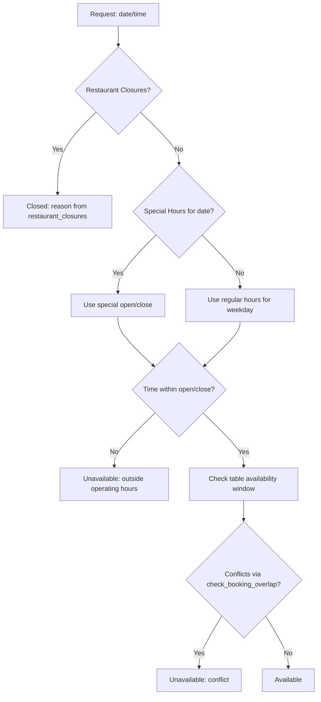
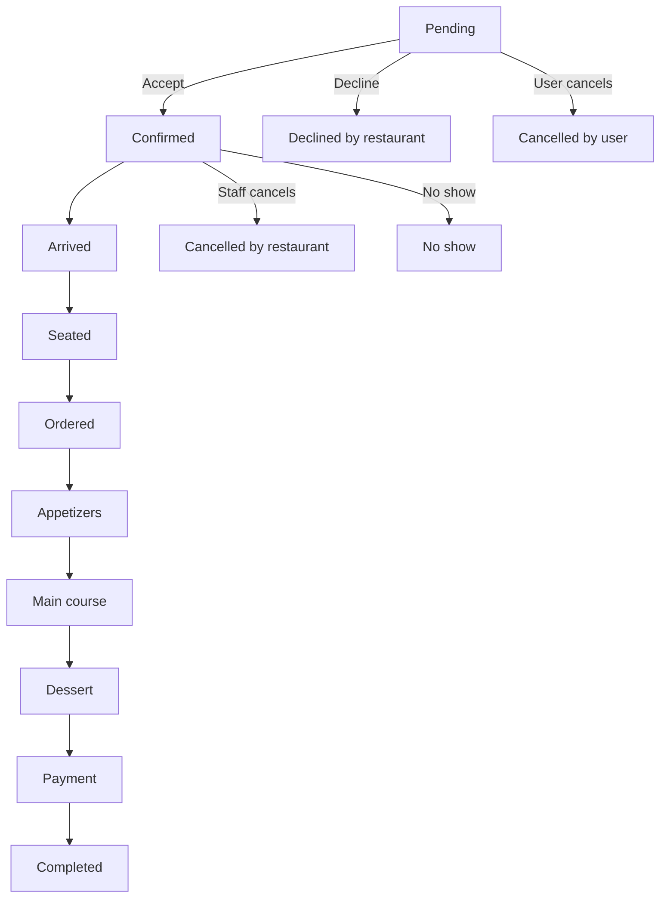
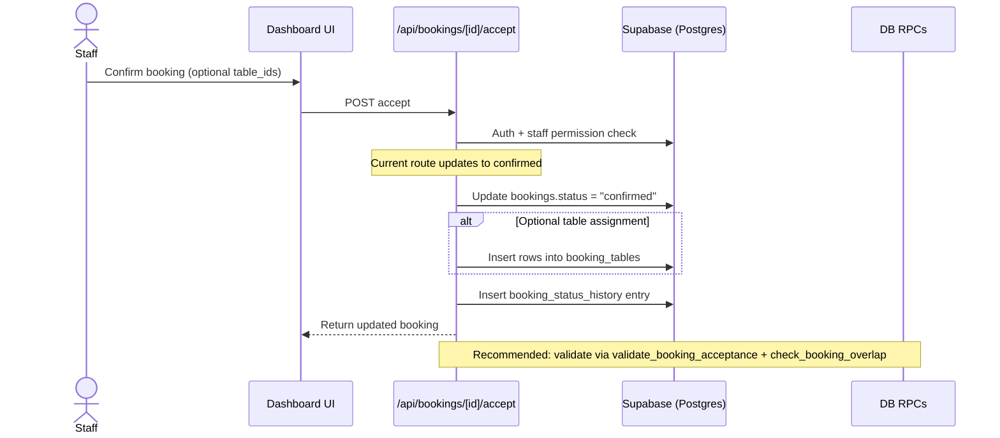
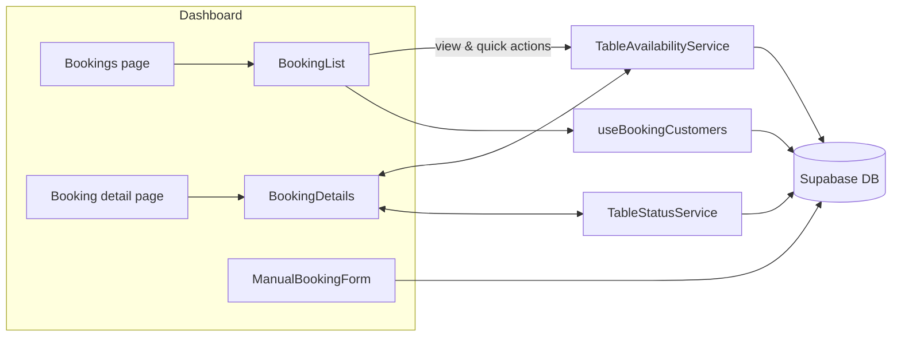

## Restaurant Booking System – Architecture & Guide

### Overview
This repository implements an end‑to‑end restaurant booking system powered by:
- Next.js App Router (API routes under `app/api`, dashboard pages under `app/(dashboard)`)
- Supabase Postgres (database tables, foreign keys, RPCs)
- React components with TanStack Query for data management
- Domain services for availability, table management, status transitions, and customer insights

High‑level flow:
- Bookings are stored in `bookings`.
- Assigned tables live in `booking_tables`.
- All status changes are logged in `booking_status_history`.
- Opening/availability derives from `restaurant_hours`, `restaurant_special_hours`, and `restaurant_closures`.
- Staff access is enforced via `restaurant_staff` + permissions.

---

### Data Model (Postgres)
Key tables:
- `bookings`: core booking details and lifecycle status
- `booking_tables`: junction between bookings and `restaurant_tables`
- `booking_status_history`: audit of all status changes
- `restaurant_tables`: table metadata (capacity, combinable, priority)
- `restaurant_hours`, `restaurant_special_hours`, `restaurant_closures`: operating hours logic
- `restaurant_customers`: per‑restaurant roll‑up of customer stats and history
- (support) `table_combinations`, `table_availability`: support complex availability calculations

Important fields and constraints (excerpt):
- `bookings.status`: comprehensive state machine across pending→confirmed→arrived→seated→…→payment→completed plus cancellation/no_show/declined states
- `bookings.turn_time_minutes` (default 120)
- `bookings.request_expires_at`: supports request‑based flows
- FKs: bookings→restaurants, bookings→profiles, booking_tables→restaurant_tables

Reference files:
- DB schema: `db/schema.sql`, `.github/database-schema.md`
- TypeScript types: `types/index.ts` (e.g. `Booking` interface)

---

### Authentication & Authorization
All booking API routes are “staff‑only”. Each handler:
- Verifies authenticated Supabase user
- Loads `restaurant_staff` record for the user
- Checks role/permissions (e.g., `owner`, `manager`, or granular like `bookings.create`, `bookings.manage`, `bookings.edit`, `bookings.delete`, `bookings.checkin`)
- Scopes reads/updates by `restaurant_id` from the staff record

Primary table: `restaurant_staff`.

---

### Backend API Endpoints (Next.js)
Base path: `/api/bookings`

1) GET `/api/bookings`
- Lists bookings for staff’s `restaurant_id`
- Filters: `date` (day window), `status` (or `all`), `limit`, `offset`
- Joins: `profiles`, `restaurants`, `booking_tables → restaurant_tables`
- File: `app/api/bookings/route.ts`

2) POST `/api/bookings`
- Creates a booking (manual staff entry)
- Validates fields; auto‑generates `confirmation_code`; default status: `pending`
- Inserts initial history (`pending`)
- File: `app/api/bookings/route.ts`

3) GET `/api/bookings/[id]`
- Returns a single booking with rich joins (profile, restaurant, tables, history)
- File: `app/api/bookings/[id]/route.ts`

4) PATCH `/api/bookings/[id]`
- Updates fields: `booking_time`, `party_size` (guarded), `status`, requests (`special_requests`, `occasion`, `dietary_notes`), guest details
- If `status` changed, appends `booking_status_history`
- File: `app/api/bookings/[id]/route.ts`

5) DELETE `/api/bookings/[id]`
- Cancels as `cancelled_by_restaurant`; logs history
- File: `app/api/bookings/[id]/route.ts`

6) POST `/api/bookings/[id]/accept`
- Accepts a `pending` booking → `confirmed`
- Optionally assigns `table_ids` into `booking_tables`; logs history
- File: `app/api/bookings/[id]/accept/route.ts`

7) POST `/api/bookings/[id]/decline`
- Declines a `pending` booking → `declined_by_restaurant`
- Accepts `reason` and optional `suggested_alternative_time`, `suggested_alternative_tables`; logs history
- File: `app/api/bookings/[id]/decline/route.ts`

8) POST `/api/bookings/[id]/check-in`
- Allows check‑in up to 30 minutes early
- Sets `status: arrived`, `checked_in_at`; logs history
- Updates `restaurant_customers` stats for registered users
- File: `app/api/bookings/[id]/check-in/route.ts`

Notes:
- All endpoints perform staff and permission checks and ensure `restaurant_id` scoping.

---

### Domain Services & Utilities

1) RestaurantAvailability (`lib/restaurant-availability.ts`)
- Determines if the restaurant is open at (date,time)
- Considers closures → special hours → regular hours (supports multiple daily shifts)
- Caches results for performance
- API: `isRestaurantOpen(restaurantId, date, time?) => { isOpen, reason?, hours? }`

2) TableAvailabilityService (`lib/table-availability.ts`)
- Computes table availability for a time window (respecting operating hours)
- Generates valid combinations (up to 2 tables currently)
- Offers: `getAvailableTablesForSlot`, `getOptimalTableAssignment`, `quickAvailabilityCheck`, `getTableTimeSlots`
- Uses DB RPC `check_booking_overlap` to detect conflicts

3) TableStatusService (`lib/table-status.ts`)
- Encapsulates dining state machine and valid transitions
- `updateBookingStatus` persists status and logs history
- `getTableStatuses` computes occupancy, next bookings, and walk‑in feasibility for a given moment
- Integrates with `RestaurantAvailability` for closing‑time/walk‑in logic

4) BookingRequestService (`lib/booking-request-service.ts`)
- Robust acceptance workflow:
  - Validates with DB RPC `validate_booking_acceptance`
  - Checks availability
  - Auto‑assigns optimal tables if none are provided
- Useful to harden acceptance (can be wired into `/accept` route)

5) Customer insights
- `lib/hooks/use-booking-customers.ts` aggregates `restaurant_customers` and profile info for bookings (VIP/blacklist/dietary flags, tags)

6) Notifications (optional)
- `app/actions.ts` exposes `sendBookingNotification(type, bookingDetails)` and `sendNotification` helpers (push); can be wired to API side‑effects

---

### RPCs (Database Functions)
- `check_booking_overlap(p_table_ids uuid[], p_start_time timestamptz, p_end_time timestamptz, p_exclude_booking_id uuid?) → uuid|null`
  - Returns conflicting booking id if overlap exists on any table for active dining statuses
- `validate_booking_acceptance(p_booking_id uuid, p_table_ids uuid[]) → jsonb { valid, reason }`
  - Ensures booking is `pending`, tables belong to the restaurant and are active, and time windows don’t conflict
- Migration reference: `db/migrations/2025-08-08-missing-rpc.sql`

---

### Frontend: Dashboard Pages & Components

Pages
- `app/(dashboard)/bookings/page.tsx`
  - Main bookings dashboard (filters, list, manual booking dialog, stats)
  - Fetches bookings with nested joins and `booking_tables`
- `app/(dashboard)/bookings/[id]/page.tsx`
  - Focused view for a single booking (history, details)

Components (subset)
- `components/bookings/booking-list.tsx`
  - Renders bookings list with quick actions (confirm/decline after basic availability check)
- `components/bookings/booking-details.tsx`
  - Detailed view for a booking, inline editing, status transition via `TableStatusService`, assign/unassign tables (writes `booking_tables`)
- `components/bookings/manual-booking-form.tsx`
  - Staff creation form with time/party size/turn time, availability checks, table selection
- `components/bookings/booking-customer-details.tsx` & `components/bookings/customer-booking-history.tsx`
  - Customer profile, notes/tags, dietary flags, and recent booking history

Data fetching
- TanStack Query is used across pages for reactive data (e.g., `useQuery` keys `["bookings", restaurantId, date, filters...]`)

---

### Booking Lifecycle & State Machine

Typical lifecycle:
1) Create (staff)
   - POST `/api/bookings` → status `pending` (or `confirmed` from UI when known)
   - History appended: `pending`
2) Accept
   - POST `/api/bookings/[id]/accept` → `confirmed`
   - Optionally assign tables; append history
   - Robust variant: use `BookingRequestService` (RPC validation, alternative suggestions)
3) Check‑in
   - POST `/api/bookings/[id]/check-in` → `arrived`, sets `checked_in_at`, updates `restaurant_customers`
4) Seat & Progress through dining
   - Client calls `TableStatusService.updateBookingStatus` to progress (`seated` → `ordered` → `...` → `payment` → `completed`)
   - Each change logged in `booking_status_history`
5) Update/Cancel
   - PATCH `/api/bookings/[id]` to edit time/party size/etc.; DELETE to cancel (`cancelled_by_restaurant`) with history

Dining status & transitions are defined in `TableStatusService.STATUS_TRANSITIONS`; progress and estimated remaining time are derived from status and `turn_time_minutes`.

---

#### Status Transition Matrix

| From                      | Allowed To                                                                                             | Notes |
|---------------------------|---------------------------------------------------------------------------------------------------------|-------|
| pending                   | confirmed, declined_by_restaurant, cancelled_by_user                                                    | Accept/decline routes enforce permissions; user cancel for public flows. |
| confirmed                 | arrived, cancelled_by_restaurant, no_show                                                               | Check‑in sets arrived; no‑show is staff action. |
| arrived                   | seated, cancelled_by_restaurant                                                                         | Seating can optionally record table metadata. |
| seated                    | ordered, cancelled_by_restaurant                                                                         | Dining progression begins. |
| ordered                   | appetizers, main_course, cancelled_by_restaurant                                                        | Can jump straight to main_course if desired. |
| appetizers                | main_course, cancelled_by_restaurant                                                                     |  |
| main_course               | dessert, cancelled_by_restaurant                                                                         |  |
| dessert                   | payment, cancelled_by_restaurant                                                                         |  |
| payment                   | completed                                                                                                | Finalize the visit. |
| any (operational)         | cancelled_by_restaurant                                                                                 | Staff cancellation available with reason logging. |
| pending/confirmed (user)  | cancelled_by_user                                                                                        | For customer cancellation flows (public endpoints). |
| confirmed (time elapsed)  | no_show                                                                                                  | Marked by staff policy after grace period. |

Implementation note: `TableStatusService` encodes common transitions and logs history. Enforce server‑side validation where needed.

#### Availability Resolution Diagram

### Availability & Table Assignment

Operating hours precedence:
1) `restaurant_closures` (closed wins)
2) `restaurant_special_hours` for that date
3) `restaurant_hours` for weekday (supports multiple shifts/day)

Assignment logic:
- Prefer a single table with capacity near party size and min capacity satisfied
- If none, consider combinations (currently up to 2 tables)
- Validate conflicts with `check_booking_overlap`
- Respect operating hours for both start and end of the booking window

Key services:
- `RestaurantAvailability.isRestaurantOpen(restaurantId, date, time?)`
- `TableAvailabilityService.getAvailableTablesForSlot(...)`
- `TableAvailabilityService.getOptimalTableAssignment(...)`
- `TableAvailabilityService.quickAvailabilityCheck(...)`

---

### Notifications & Customer Context

- `sendBookingNotification` in `app/actions.ts` supports: `new_booking`, `booking_reminder`, `booking_cancelled`
- Customer context in UI is powered by `restaurant_customers` + profile data via `useBookingCustomers` and related components
- Check‑in updates `restaurant_customers` statistics (`first_visit`, `last_visit`, `total_bookings`)

---

### How Things Interact (End‑to‑End)

Create → Accept → Check‑in → Seat → Complete:
- Create: ManualBookingForm → API insert `bookings` → status history `pending`
- Accept: `/accept` → `confirmed` + optional `booking_tables` → history
- Check‑in: `/check-in` → `arrived` + `checked_in_at` → history + `restaurant_customers` upsert/update
- Seat/Progress: `TableStatusService.updateBookingStatus` → subsequent statuses → history
- Complete/Cancel: final status changes; history tracks full audit

`TableStatusService.getTableStatuses` computes live occupancy and walk‑in feasibility, factoring in hours (`RestaurantAvailability`) and next bookings.

---

### Visual Diagrams

#### Booking Lifecycle

#### Acceptance Flow (API/DB)

#### Component & Service Map

### Operational Notes & Caveats

- Acceptance hardening: the current `/accept` route updates to `confirmed` without RPC validation; consider using `BookingRequestService` to enforce `validate_booking_acceptance` and to propose alternatives.
- Table combinations limited to 2; adjust in `TableAvailabilityService` if you need more complex combinations.
- Client‑side transitions are convenient; ensure critical invariants (e.g., no seating while closed) are also validated server‑side as needed.
- `restaurants.booking_policy` exists; align default POST behavior (`pending` vs `confirmed`) with policy.
- Push notifications are available but not fully wired to all booking API mutations.

---

### Notable Files Index

Schema & migrations
- `db/schema.sql`
- `.github/database-schema.md`
- `db/migrations/2025-08-08-missing-rpc.sql`

Types
- `types/index.ts`

APIs
- `app/api/bookings/route.ts`
- `app/api/bookings/[id]/route.ts`
- `app/api/bookings/[id]/accept/route.ts`
- `app/api/bookings/[id]/decline/route.ts`
- `app/api/bookings/[id]/check-in/route.ts`

Services & hooks
- `lib/restaurant-availability.ts`
- `lib/table-availability.ts`
- `lib/table-status.ts`
- `lib/booking-request-service.ts`
- `lib/hooks/use-booking-customers.ts`

UI pages & components
- `app/(dashboard)/bookings/page.tsx`
- `app/(dashboard)/bookings/[id]/page.tsx`
- `components/bookings/booking-list.tsx`
- `components/bookings/booking-details.tsx`
- `components/bookings/manual-booking-form.tsx`
- `components/bookings/booking-customer-details.tsx`
- `components/bookings/customer-booking-history.tsx`

---

### Extending the System
- Customer‑facing booking UI & API with RLS and email/SMS confirmations
- Wire notifications into accept/decline/check‑in/cancel flows
- Robustify `/accept` via `BookingRequestService` + RPC validation + optimal auto‑assignment
- Advanced reporting from `booking_status_history` and `restaurant_customers`
- Deeper waitlist integration (promote to booking)

